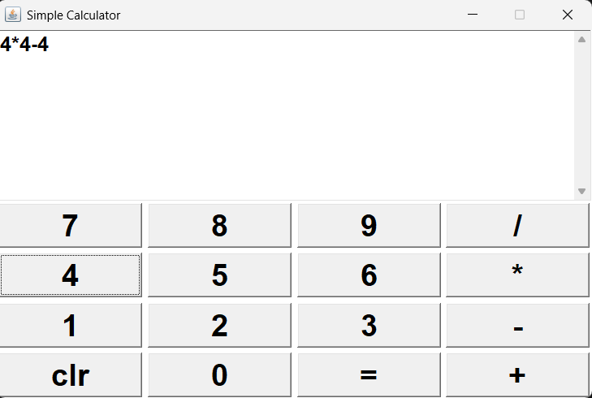
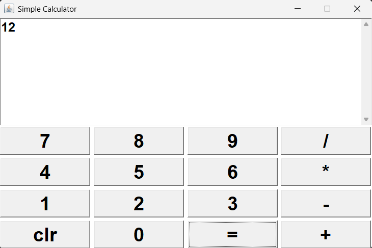

# Java AWT Calculator

## 📌 Description
A simple calculator application built using Java AWT.

## 🚀 Features
- Addition
- Subtraction
- Multiplication
- Division

## 🛠️ Technologies Used
- Java
- AWT

## 📷 Screenshot

## 📚 Learning Outcomes
- GUI development
- Event handling
- Java project structure
